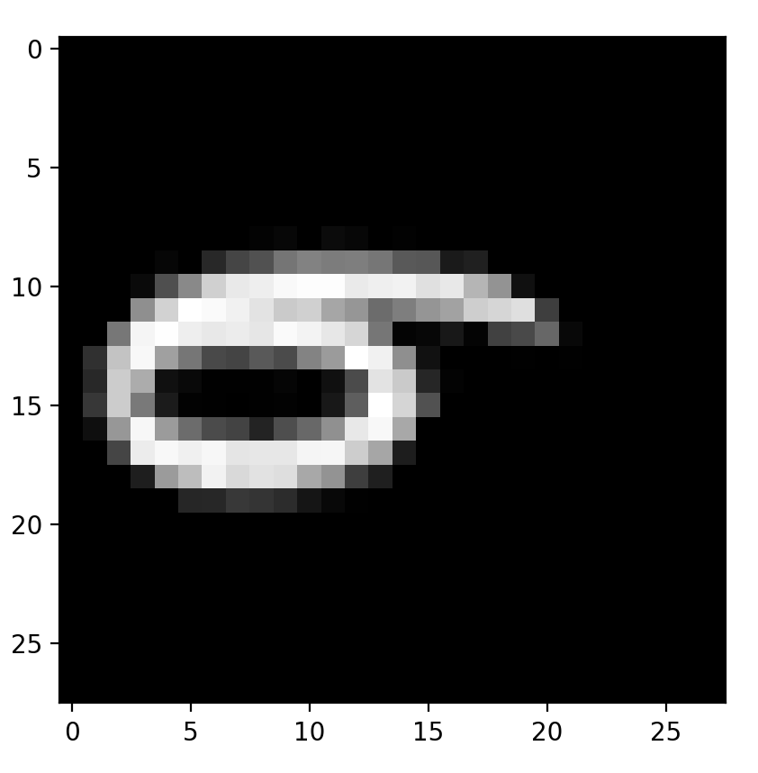
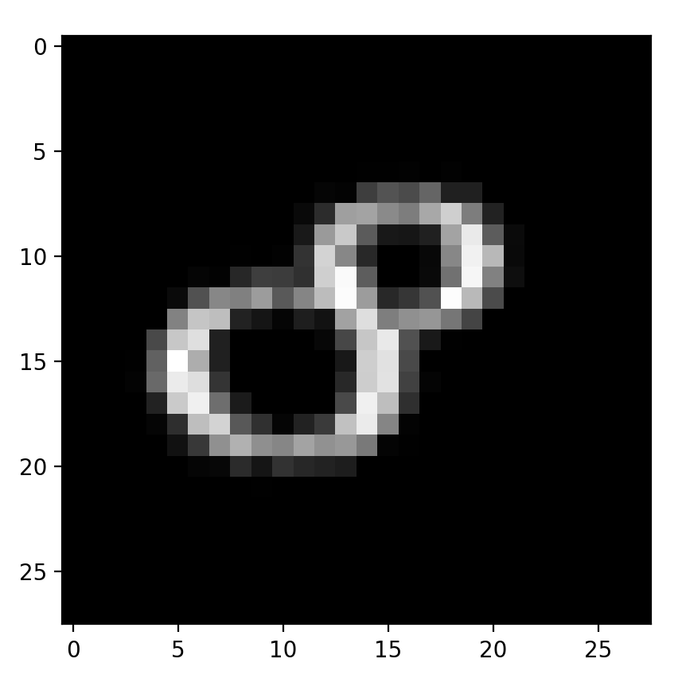

# Machine Learning
Machine learning are programs that can discover their own algorithm instead of using preprogramed alogithms by the user. Artificial intelligence is a general term where the machine uses computer science and data to solve problems. Machine learning, a subcategory of artificial intelligence, is a machine that can learn and adapt automatically from experience without being explicitly programmed. Deep learning, a subcategory of machine learning, uses layers of algorithms to analyze data.


Machine learning have 3 main categories:
* Supervised learning: machine is presented with example inputs and their desired outputs and the goal is to learn a general rule that maps inputs to outputs.
* Unsupervised learning: No labels are given to the learning algorithm, the machine is to learn a general rule by itself.
* Reinforcement learning: A program interacts with a dynamic environment and perform certain goals (like a board game)

# Neural Network
Neural network is modeled after neurons by using many nodes in one layer connected to the next layer of nodes. Each node is connected to each node from the previous layer. Each connection line between nodes uses a weight/gain to show how much a node effects the next one. Each node is a summation of all the previous nodes times the associated weights. Then a function (activation) is applied to the result to rescale the large value to a range 0 to 1.


A neural network calculates using forward propagation by inputing data on the input layer and using the associated weights to signify how much that specific node affects the next one. Then using a function to rescale all the values in the middle layers. The same process is repeated at each layer until the output layer. The output layer is the final calculation/answer. Then the neural network learns using backward propagation by comparing the calculated results with the desired results. The neural network is told what the answers should be and it needs to change the weights to cause the calculated results to match to desired results as close as possible. It changes to weights by the derivatives of the errors with respect to each weight.

# Forward Propagation


$$ y_1 = x_1 w_{11} + x_2 w_{12} + ... + x_i w_{1i} + b_1 $$

$$ y_2 = x_1 w_{21} + x_2 w_{22} + ... + x_i w_{2i} + b_2 $$

$$ y_3 = x_1 w_{31} + x_2 w_{32} + ... + x_i w_{3i} + b_3 $$

$$ y_j = x_1 w_{j1} + x_2 w_{j2} + ... + x_i w_{ji} + b_j $$

$$ 
\begin{bmatrix} y_1 \\\ y_2 \\\ ... \\\ y_j \end{bmatrix}_{jx1} =
\begin{bmatrix} w_{11} && w_{12} && ... && w_{1i} \\\ w_{21} && w_{22} && ... && w_{2i} \\\ ... && ... && && ... \\\ w_{j1} && w_{j2} && ... && w_{ji} \end{bmatrix}_{jxi}
\begin{bmatrix} x_1 \\\ x_2 \\\ ... \\\ x_i \end{bmatrix}_{ix1} +
\begin{bmatrix} b_1 \\\ b_2 \\\ ... \\\ b_j \end{bmatrix}_{jx1} 
$$

$$ Y = W * X + B $$

# Backward Propagation
$\frac{dE}{dY}$ derivative of error with respect to output

$\frac{dE}{dW}$ derivative of error with repect to weight

$\frac{dE}{dB}$ derivative of error with repect to bias

$\frac{dE}{dX}$ derivative of error with repect to input

$$
\frac{dE}{dY} = 
\begin{bmatrix}
\frac{dE}{dy_1} \\ \frac{dE}{dy_2} \\ ... \\ \frac{dE}{dy_j} 
\end{bmatrix}_{jx1}
$$

$$
\frac{dE}{dW} = 
\begin{bmatrix}
\frac{dE}{dw_{11}} && \frac{dE}{dw_{12}} && ... && \frac{dE}{dw_{1i}} \\\ \frac{dE}{dw_{21}} && \frac{dE}{dw_{22}} && ... && \frac{dE}{dw_{2i}} \\\ ... && ...&& && ... \\\ \frac{dE}{dw_{j1}} && \frac{dE}{dw_{j2}} && ... && \frac{dE}{dw_{ji}} 
\end{bmatrix}_{jxi}
$$

$$
\frac{dE}{dB} =
\begin{bmatrix}
\frac{dE}{db_1} \\\ \frac{dE}{db_2} \\\ ... \\\ \frac{dE}{db_j}
\end{bmatrix}_{jx1}
$$

$$
\frac{dE}{dX} = 
\begin{bmatrix}
\frac{dE}{dx_1} \\\ \frac{dE}{dx_2} \\\ ... \\\ \frac{dE}{dx_i}
\end{bmatrix}_{ix1}
$$

---
$$\frac{dE}{dw_{12}} = \frac{dE}{dy_1}\frac{dy_1}{dw_{12}} + \frac{dE}{dy_2}\frac{dy_2}{dw_{12}} + ... + \frac{dE}{dy_i}\frac{dy_i}{dw_{12}}$$

$$
\frac{dE}{dw_{12}} = \frac{dE}{dy_1} x_2 + \frac{dE}{dy_2} 0 + ... + \frac{dE}{dy_j} 0
$$

$$
\frac{dE}{dw_{ji}} = \frac{dE}{dy_j} x_i
$$

$$
\frac{dE}{dW} = 
\begin{bmatrix}
\frac{dE}{dy_1} x_1 && \frac{dE}{dy_1} x_2 && ... && \frac{dE}{dy_1} x_i \\\ \frac{dE}{dy_2} x_1 && \frac{dE}{dy_2} x_2 && ... && \frac{dE}{dy_2} x_i \\\ ... && ... && && ... \\\ \frac{dE}{dy_j} x_1 && \frac{dE}{dy_j} x_2 && ... && \frac{dE}{dy_j} x_i
\end{bmatrix}_{jxi}
$$

$$
\frac{dE}{dW} =
\begin{bmatrix}
\frac{dE}{dy_1} \\\ \frac{dE}{dy_2} \\\ ... \\\ \frac{dE}{dy_j}
\end{bmatrix}_{jx1}
\begin{bmatrix}
x_1 && x_2 && ... && x_i
\end{bmatrix}_{1xi}
$$

$$
\frac{dE}{dW} = 
\frac{dE}{dY} * X^T
$$

---
$$
\frac{dE}{db_1} =
\frac{dE}{dy_1}\frac{dy_1}{db_1} + \frac{dE}{dy_2}\frac{dy_2}{db_1} + ... + \frac{dE}{dy_j}\frac{dy_j}{db_1}
$$

$$
\frac{dE}{db_1} = 
\frac{dE}{dy_1} 1 + \frac{dE}{dy_2} 0 + ... + \frac{dE}{dy_j} 0
$$

$$
\frac{dE}{db_j} = \frac{dE}{dy_j}
$$

$$
\frac{dE}{dB} = \frac{dE}{dY}
$$

---
$$
\frac{dE}{dx_1} = 
\frac{dE}{dy_1}\frac{dy_1}{dx_1} + \frac{dE}{dy_2}\frac{dy_2}{dx_1} + ... + \frac{dE}{dy_j}\frac{dy_j}{dx_1}
$$

$$
\frac{dE}{dx_1} = \frac{dE}{dy_1} w_{11} + \frac{dE}{dy_2} w_{21} + ... + \frac{dE}{dy_j} w_{j1}
$$

$$
\frac{dE}{dx_i} = \frac{dE}{dy_1} w_{1i} + \frac{dE}{dy_2} w_{2i} + ... + \frac{dE}{dy_j} w_{ji}
$$

$$
\frac{dE}{dX} =
\begin{bmatrix}
\frac{dE}{dx_1} \\\ \frac{dE}{dx_x} \\\ ... \\\ \frac{dE}{dx_i}
\end{bmatrix} =
\begin{bmatrix}
\frac{dE}{dy_1} w_{11} + \frac{dE}{dy_2} w_{21} + ... + \frac{dE}{dy_j} w_{j1} \\\ \frac{dE}{dy_1} w_{12} + \frac{dE}{dy_2} w_{22} + ... + \frac{dE}{dy_j} w_{j2} \\\ ... \\\ \frac{dE}{dy_1} w_{1i} + \frac{dE}{dy_2} w_{2i} + ... + \frac{dE}{dy_j} w_{ji}
\end{bmatrix}_{ix1}
$$

$$
\frac{dE}{dX} = 
\begin{bmatrix}
w_{11} && w_{21} && ... && w_{j1} \\\ w_{12} && w_{22} && ... && w_{j2} \\\ ... && ... && && ... \\\ w_{1i} && w_{2i} && ... && w_{ji}
\end{bmatrix}_{ixj}
\begin{bmatrix}
\frac{dE}{dy_1} \\\ \frac{dE}{dy_2} \\\ ... \\\ \frac{dE}{dy_j}
\end{bmatrix}_{jx1}
$$

$$
\frac{dE}{dX} = w^T * \frac{dE}{dY}
$$

---
Backward propagation

$$
\frac{dE}{dW} = \frac{dE}{dY} * X^T
$$

$$
\frac{dE}{dX} = w^T * \frac{dE}{dY}
$$

$$
weights = weights - gain * \frac{dE}{dW}
$$

$$
bias = bias - gain * \frac{dE}{dY}
$$

# Activation Function: Sigmoid Function
Forward propagation

$$
y_1 = f(x_1)
$$

$$
y_2 = f(x_2)
$$

$$
y_i = f(x_i)
$$

$$
Y = f(X)
$$

Backward propagation

$$
\frac{dE}{dx_1} =
\frac{dE}{dy_1}\frac{dy_1}{dx_1}
$$

$$
\frac{dE}{dx_1} = \frac{dE}{dy_1} f'(x_1)
$$

$$
\frac{dE}{dx_i} = \frac{dE}{dy_i} f'(x_i)
$$

$$
\frac{dE}{dX} = \frac{dE}{dY} * f'(X)
$$

---
Sigmoid

$$
f(x) = \frac{1}{1 + e^{-x}}
$$

$$
\frac{df}{dx} = (1+e^{-x})^{-1} =
-1(1 + e^{-x})^{-2} * (0 + e^{-x}) * -1
$$

$$
\frac{df}{dx} = \frac{e^{-x}}{(1 + e^{-x})^2} = \frac{1}{(1+e^{-x})} * \frac{e^{-x}}{(1 + e^{-x})}
$$

$$
\frac{df}{dx} = 
\frac{1}{(1+e^{-x})} * \frac{1 + e^{-x} - 1}{(1+e^{-x})} = \frac{1}{(1+e^{-x})} (\frac{1+e^{-x}}{(1+e^{-x})} - \frac{1}{(1+e^{-x})})
$$

$$
f'(x) = f(x) * (1 - f(x))
$$


# Mean Square Error
Forward propagation

$$
E = \frac{1}{n}\sum(y_i^* - y_i)^2
$$

* $y^*$: desired output
* $y$: calculated output

Backward propagation

$$
\frac{dE}{dy_1} = 
\frac{d}{dy_1}\frac{1}{n}[(y_1^*-y_1)^2 + (y_2^*-y_2)^2 + ... + (y_n^*-y_n)^2]
$$ 

$$
\frac{dE}{dy_1} = 
\frac{1}{n}[2(y_1^*-y_1)^2*-1 + 0 + ... + 0]
$$ 

$$
\frac{dE}{dy_1} = 
\frac{2}{n}(y_1-y_1^*)
$$

$$
\frac{dE}{dy_i} = 
\frac{2}{n}(y_i-y_i^*)
$$

$$
\frac{dE}{dY} = \frac{2}{n}(Y-Y^*)
$$

# MNIST Database
Modified National Institude of Standards and Technology database is a large database of handwritten digits that is being used for training my machine learning model. Each digit 0-9 have 1000 grayscale pictures of 28 by 28 pixels. Each picture is fed into the model along with their labels for supervised learning. This model reaches ~85% correct (need fixing). The output is a vertical vector where each index represents a digit and the percent of certainty for the digit.

# Plots

```
answer: [0]
output:
 [[0.32292621]
 [0.00050137]
 [0.00003627]
 [0.00002452]
 [0.05033856]
 [0.00002927]
 [0.00000046]
 [0.14192464]
 [0.02301695]
 [0.10000119]]
predict: 0
```


```
answer: [1]
 [[0.00000901]
 [0.74283506]
 [0.02150402]
 [0.00002158]
 [0.00001969]
 [0.30268229]
 [0.00276948]
 [0.00090335]
 [0.03060214]
 [0.00072113]]
predict: 1
```


```
answer: [2]
output:
 [[0.0000962 ]
 [0.13657945]
 [0.97797358]
 [0.00073236]
 [0.00005045]
 [0.00233526]
 [0.00013864]
 [0.00646445]
 [0.00007538]
 [0.00033277]]
predict: 2
```


```
answer: [3]
output:
 [[0.00000282]
 [0.00159047]
 [0.00046823]
 [0.90408249]
 [0.01748556]
 [0.09081709]
 [0.0017015 ]
 [0.00514519]
 [0.0013385 ]
 [0.00124742]]
predict: 3
```


```
answer: [4]
output:
 [[0.00535995]
 [0.00006532]
 [0.00276469]
 [0.00019772]
 [0.80580539]
 [0.00016353]
 [0.00294275]
 [0.06599702]
 [0.01437955]
 [0.00643617]]
predict: 4
```


```
answer: [5]
output:
 [[0.05483943]
 [0.09317108]
 [0.00002746]
 [0.00059487]
 [0.00000092]
 [0.65808366]
 [0.00000073]
 [0.02750957]
 [0.00167686]
 [0.00198634]]
predict: 5
```


```
answer: [6]
output:
 [[0.01344772]
 [0.00041652]
 [0.00007401]
 [0.01186355]
 [0.00049649]
 [0.46343433]
 [0.71527148]
 [0.00015354]
 [0.00713966]
 [0.00133767]]
predict: 6
```


```
answer: [7]
output:
 [[0.00049613]
 [0.00001056]
 [0.03368939]
 [0.00000774]
 [0.01037475]
 [0.00000272]
 [0.00000192]
 [0.99785128]
 [0.00002384]
 [0.00470216]]
predict: 7
```


```
answer: [8]
output:
 [[0.00003017]
 [0.0377396 ]
 [0.0004202 ]
 [0.0301417 ]
 [0.00003531]
 [0.14856098]
 [0.08350986]
 [0.00014007]
 [0.67392882]
 [0.01559781]]
predict: 8
```


```
answer: [9]
output:
 [[0.00372826]
 [0.00040314]
 [0.00056716]
 [0.00142642]
 [0.16788582]
 [0.00128718]
 [0.01386543]
 [0.00041891]
 [0.27617057]
 [0.87221455]]
predict: 9
```

# References
[Independent Code](https://www.youtube.com/watch?v=pauPCy_s0Ok)
